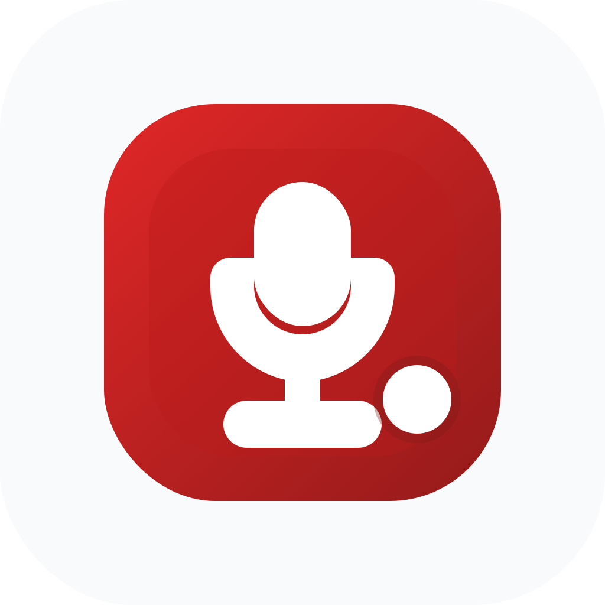

# Mic Stop

<p align="center">
  
</p>

Mic Stop is a tiny menu bar utility for macOS that lets you mute or unmute your microphone with a global hotkey.

It stays out of the way, lives in the menu bar, and keeps your chosen mute state even if you switch from your MacBook mic to a Bluetooth headset or another input device.

## What It Does

- toggles your microphone from anywhere with a keyboard shortcut
- runs quietly in the menu bar without a Dock icon
- remembers your preferred hotkey
- follows microphone changes automatically
- can launch when you log in

## Requirements

- macOS Sequoia or newer

## Running the App

If you want the proper macOS app experience, open `MicStop.xcodeproj` in Xcode and run the `MicStop` scheme.

If Xcode asks for signing, select your own Apple development team in the project settings.

## Running from Swift Package Manager

```bash
swift run --disable-sandbox MicStopApp
```

## Running Tests

```bash
swift test --disable-sandbox
```
